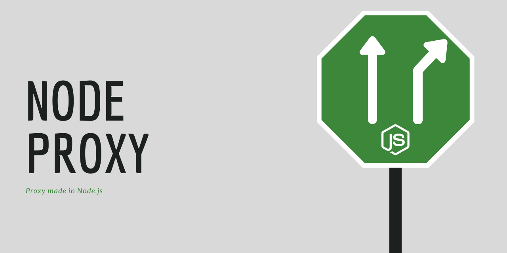

# Node Proxy



* Reverse proxy
* Create proxies dynamically
* Prometheus metrics
* Procted by [helmet](https://helmetjs.github.io/)
* Graceful Shutdown

## Getting started

Start a proxy usig docker:

```bash
docker container run \
  -p 3000:3000 \
  -v "node-proxy:/usr/src/app/" \
  -e NODE_ENV=production \
  --name node-proxy \
  gabrielrufino/node-proxy
```

## API

These are one of the routes for managing the proxy server. You can see the rest of them in the swagger docs.

### Ping route

> GET /

Response:

```json
{"I":"am alive"}
```

### Create a proxy

> POST /proxies

```json
{
  "namespace": "users",
  "target": "https://users.yourmicroservices.dev"
}
```

## LICENSE

MIT
